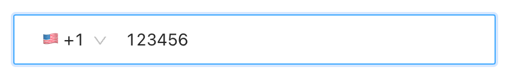

# antd-country-phone-input

Country phone input component as standard Ant.Design form item.



## Installation

```bash
npm install antd-country-phone-input
```
or
```
yarn add antd-country-phone-input
```

## Usage

- [Example](example/src/App.tsx)
- [Online Demo](https://boyuai.github.io/antd-country-phone-input/)
