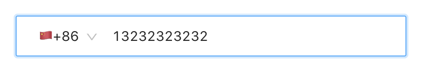

# antd-country-phone-input

Country phone input component as standard Ant.Design form item.

Currently only support Chinese.



## Installation

```
npm i antd-country-phone-input
```

## Usage

[](https://codesandbox.io/s/antd-country-phone-input-mtksn?fontsize=14)

```js
import React from "react";
import ReactDOM from "react-dom";
import { Form } from "antd";
import CountryPhoneCode from "antd-country-phone-input";
import "antd/dist/antd.css";

const App = ({ form }) => {
  const submit = e => {
    e.preventDefault();
    form.validateFields((err, values) => {
      if (!err) {
        console.log("Received values of form: ", values);
      }
    });
  };
  return (
    <Form onSubmit={submit}>
      <Form.Item>
        {form.getFieldDecorator("countryPhone")(<CountryPhoneCode />)}
      </Form.Item>
    </Form>
  );
};

const WrappedApp = Form.create({
  mapPropsToFields(props) {
    return {
      countryPhone: Form.createFormField({
        value: { code: 86, phone: "13012345678" }
      })
    };
  }
})(App);

const rootElement = document.getElementById("root");
ReactDOM.render(<WrappedApp />, rootElement);
```
